# Paso 2: USUARIOS: ALTA DE USUARIOS DEL SISTEMA, EMPLEADOS (ALGUNOS, NO TODOS, PUEDEN SER USUARIOS DEL SISTEMA), CLIENTES Y PROVEEDORES.
#### Asignado a Miguel Gutiérrez Rodríguez.

## Creación de usuarios

Para acceder a los usuarios entramos en **Ajustes**.

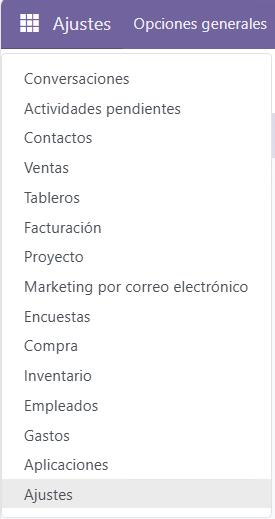

Y le damos a **usuarios**.

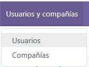

Seguido clicamos en nuevo.

Y creamos los usuarios que deseemos, en nuestro caso creamos a **Ulises y Angel**.

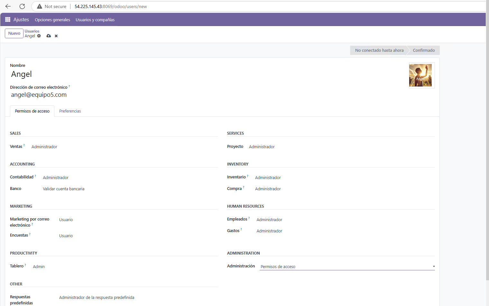

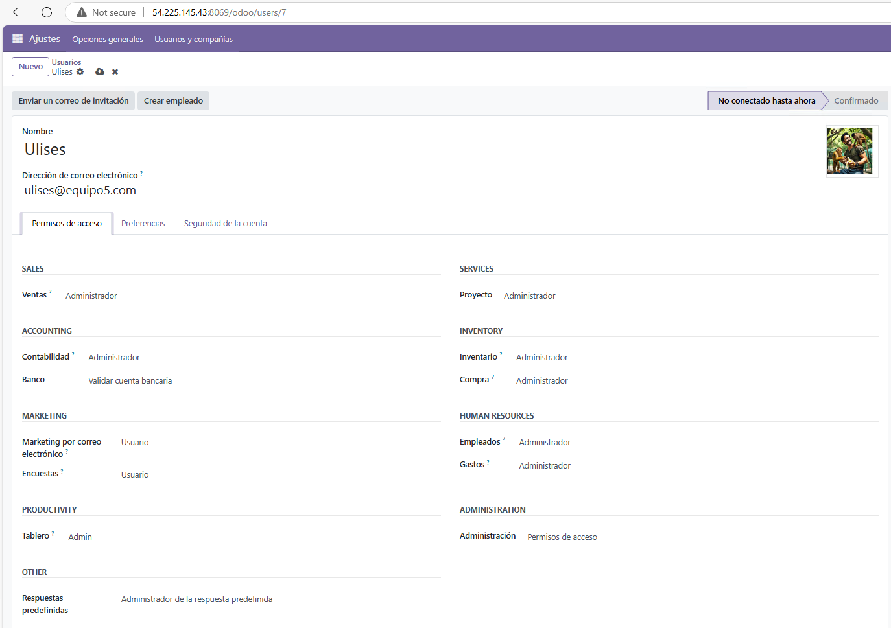

Este sería el resultado de su creación:

## Creación de empleados

A la hora de crear empleados usaremos nuestros nombres y puestos de trabajo, (Ulises y Angel son usuarios y empleados),Angel sería el **secretario**, Hafsa **investigadora**, Ulises **Implementador** y Miguel sería el **portavoz**.

Clickamos en el apartado **Empleados**.

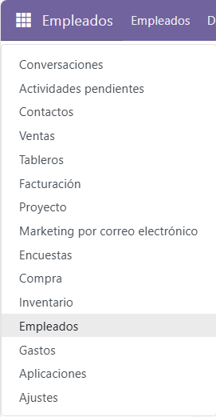

Y clickamos en **nuevo empleado**.

Crearemos a los empleados **Hafsa y Miguel**.

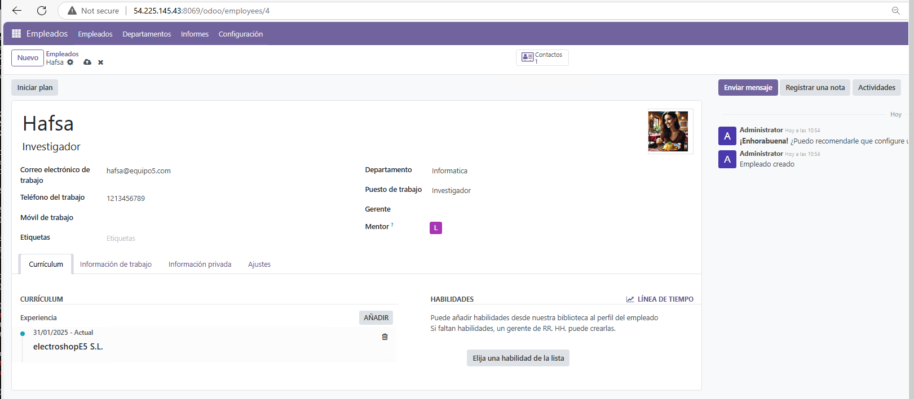

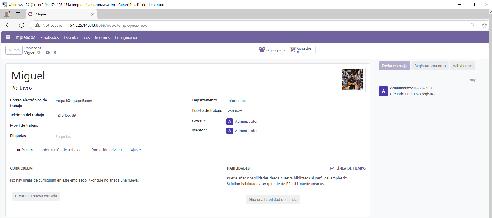

Este sería el resultado de la creación de empleados:

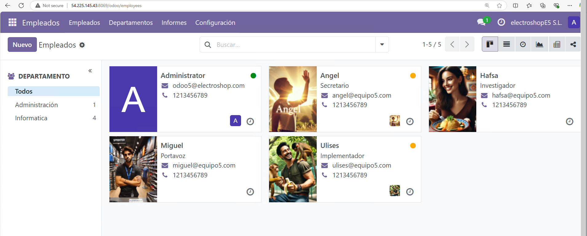

## Creación de Clientes y Compañías

Para este apartado crearemos dos **compañias** que son clientes y dos **individuos** que pertenecen a dichas compañías (En nuestro caso hemos añadido 4 individuos).

Para acceder a los clientes y compañías clickamos en **ventas**

Le damos a **nuevo cliente**.

Seguido Creamos las dos compañías, en nuestro caso **Las Palmas FC y XBOX** (En la imagen se llama XVOX pero lo corregimos).

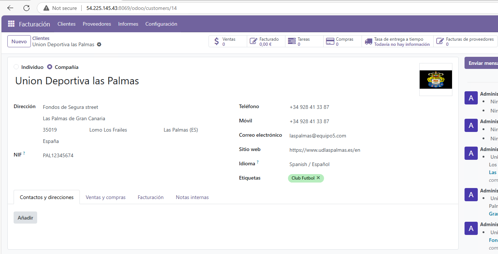

**Como se ve tiene marcada la opción de compañia**.

Y los individuos que le pertenecen a sus compañías:

Para Las palmas **Alex Muñoz y Alvaro Valles**:

Y para XBOX crearemos a **Santiago Abascal y Pedro Sanchez**:

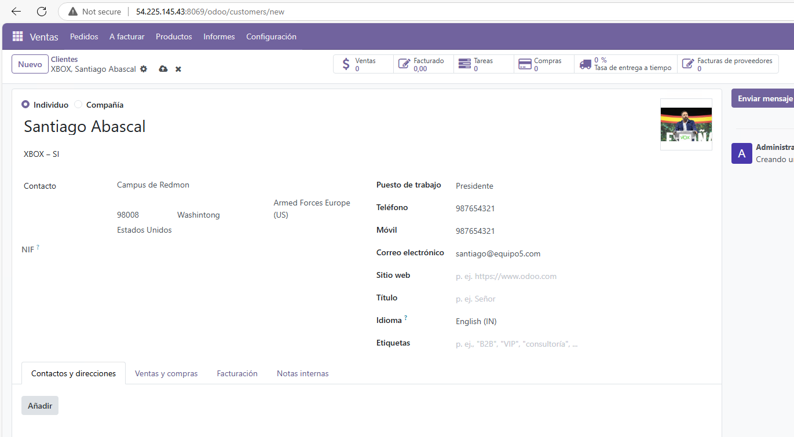

**Y como en el caso anterior estos tienen marcada la opcion individuo**.

Esta sería la vista final de los clientes.

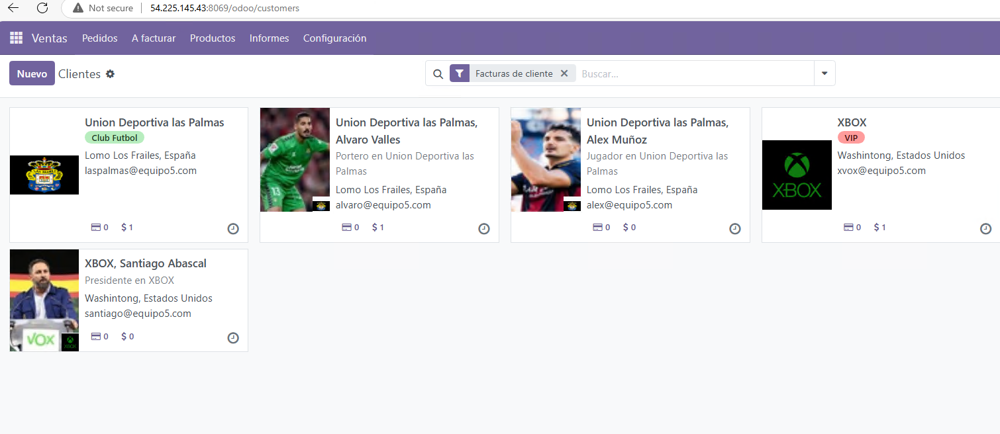

(Como se ve el nombre de XBOX está corregido).

## Creación de proveedores

En este apartado crearemos dos **proveedores**, en nuestro caso nos proveen **Nike y Riot Games**.

Para acceder a los proveedores vamos al apartado **Compra**.

Y le damos a **nuevo proveedor**.

Creamos los proveedores Nike y Riot Games.

Este sería el resultado de la creación de proveedores.

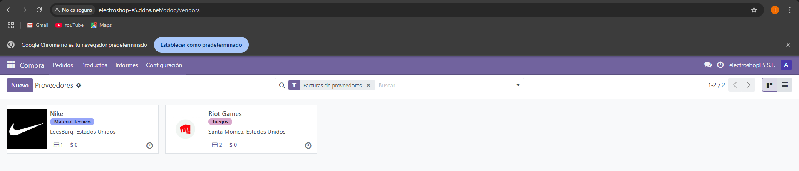

## Resultado final

Este seria el resultado final de toda la creación de usuarios,empleados, clientes y proveedores.

 
