# Paso 2: USUARIOS: ALTA DE USUARIOS DEL SISTEMA, EMPLEADOS (ALGUNOS, NO TODOS, PUEDEN SER USUARIOS DEL SISTEMA), CLIENTES Y PROVEEDORES.
#### Asignado a Miguel Gutiérrez Rodríguez.
## Creación de usuarios
Para acceder a los usuarios entramos en **Ajustes**.
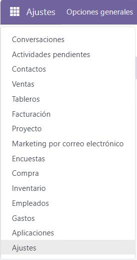
Y le damos a usuarios.
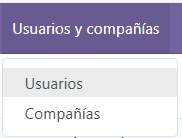
Seguido clicamos en nuevo.

Y creamos los usuarios que deseemos, en nuestro caso creamos a Ulises y Angel.
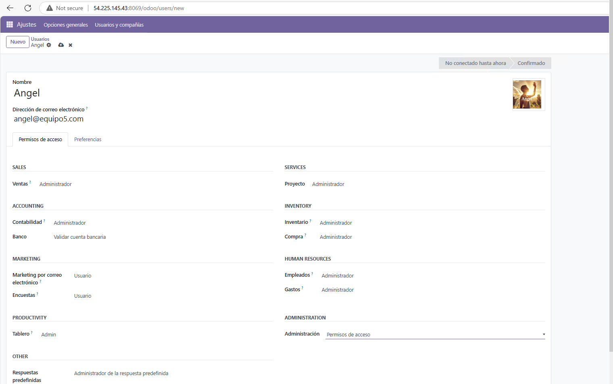
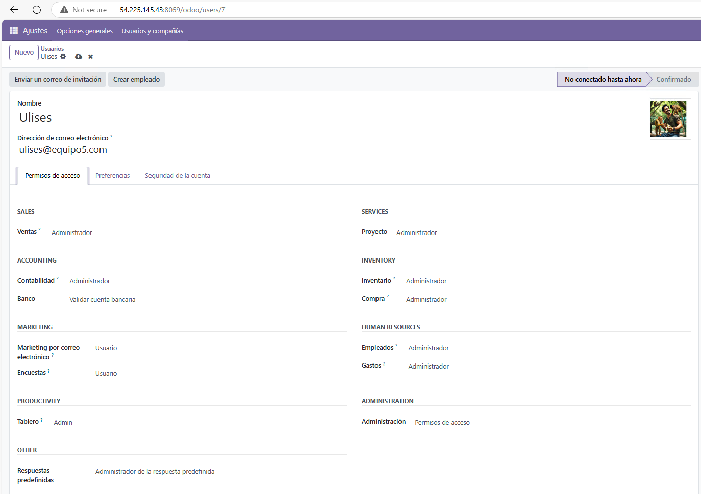
Este sería el resultado de su creación:
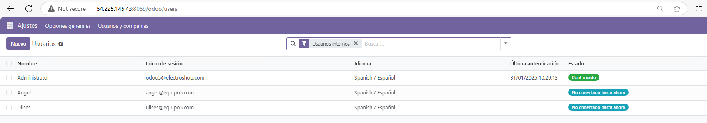
## Creación de empleados
A la hora de crear empleados usaremos nuestros nombres y puestos de trabajo, (Ulises y Angel son usuarios y empleados),Angel sería el secretario, Hafsa investigadora, Ulises Implementador y Miguel sería el administrador.
Clickamos en el apartado **Empleados**.

Y clickamos en nuevo empleado.

Crearemos a los empleados Hafsa y Miguel.
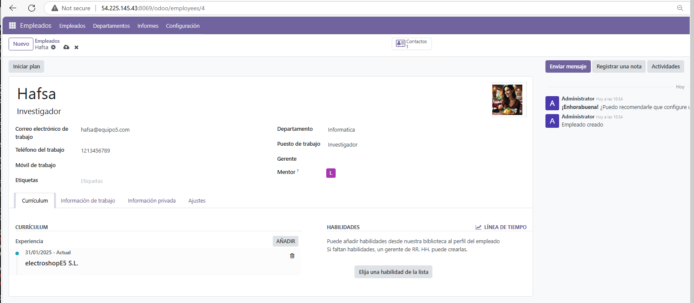
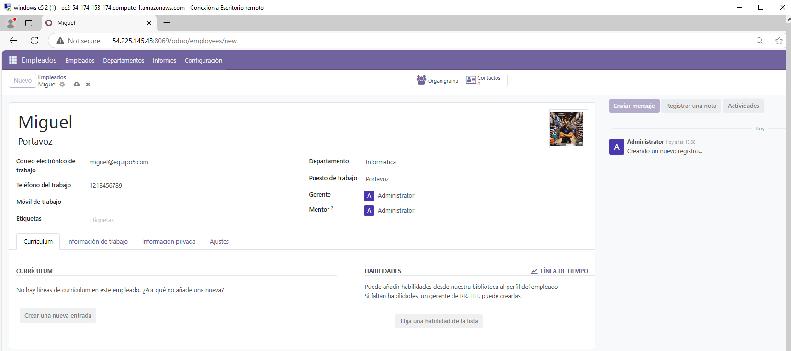
Este sería el resultado de la creación de empleados:
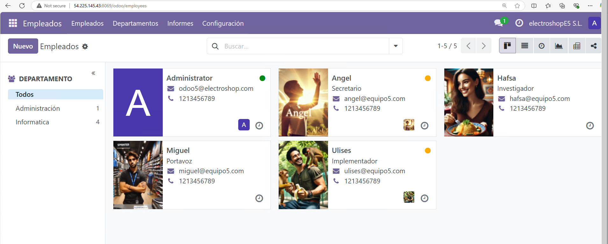
## Creación de Clientes y Compañías
Para este apartado crearemos dos compañias que son clientes y dos individuos que pertenecen a dichas compañías (En nuestro caso hemos añadido 4 individuos).
Para acceder a los clientes y compañías clickamos en **ventas**
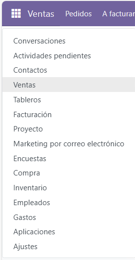
Le damos a nuevo cliente.

Seguido Creamos las dos compañías, en nuestro caso Las Palmas FC y XBOX (En la imagen se llama XVOX pero lo corregimos).
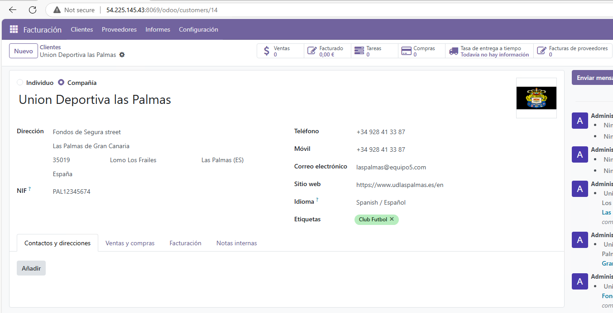
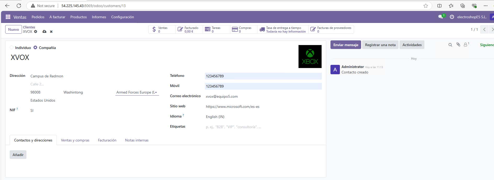
**Como se ve tiene marcada la opción de compañia**.
Y los individuos que le pertenecen a sus compañías:
Para Las palmas Alex Muñoz y Alvaro Valles:
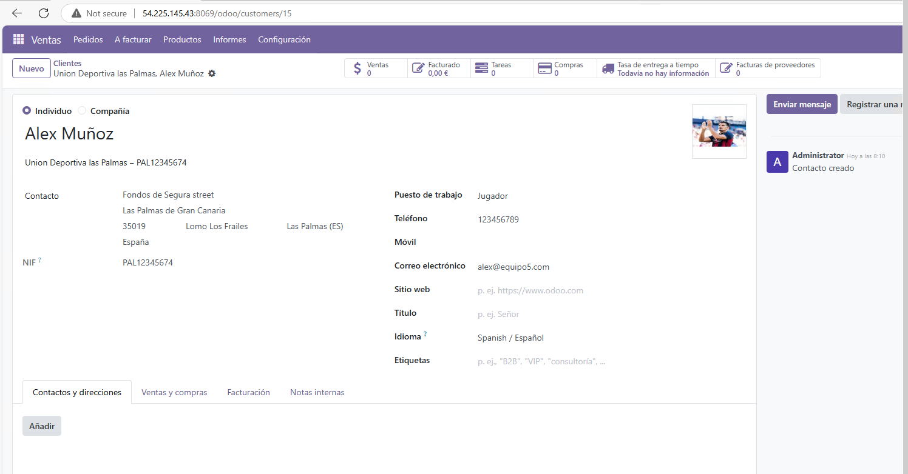

Y para XBOX crearemos a Santiago Abascal y Pedro Sanchez:
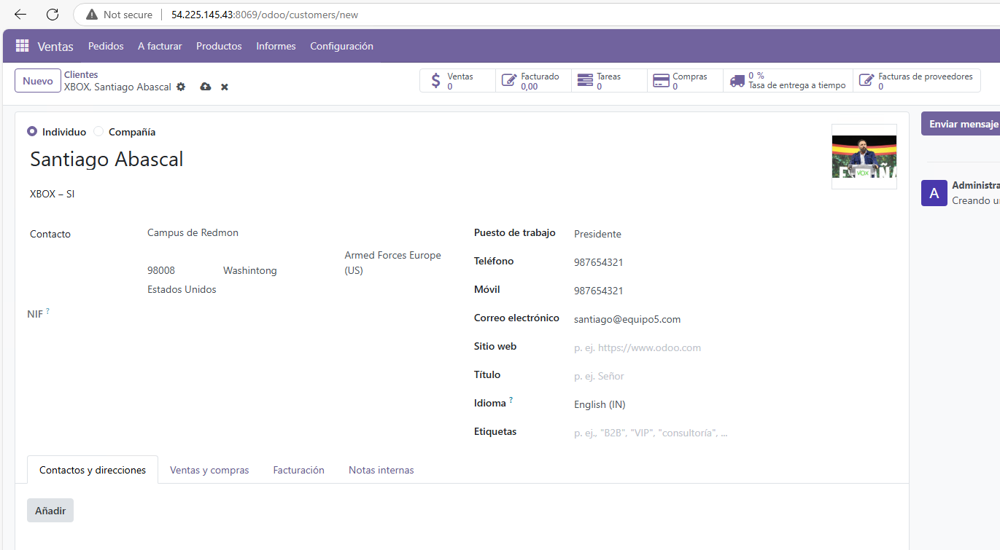
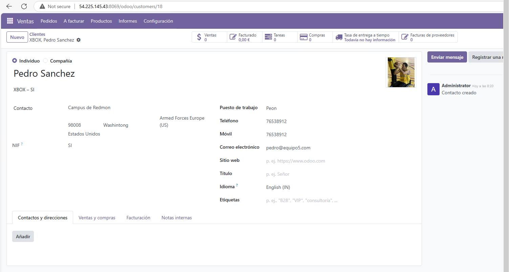
**Y como en el caso anterior estos tienen marcada la opcion individuo**.
Esta sería la vista final de los clientes.
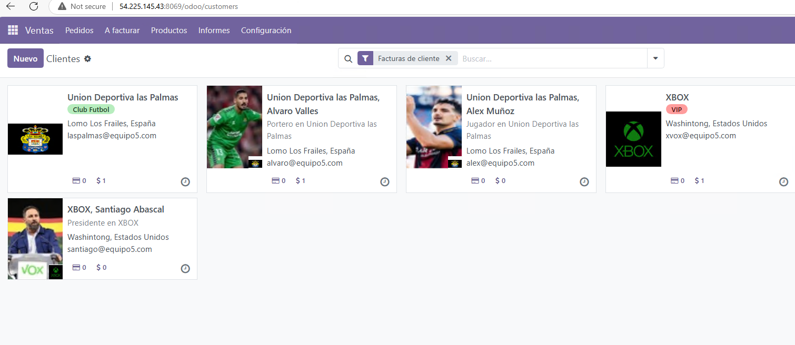
(Como se ve el nombre de XBOX está corregido).
## Creación de proveedores
En este apartado crearemos dos proveedores, en nuestro caso nos proveen Nike y Riot Games.
Para acceder a los proveedores vamos al apartado **Compra**.
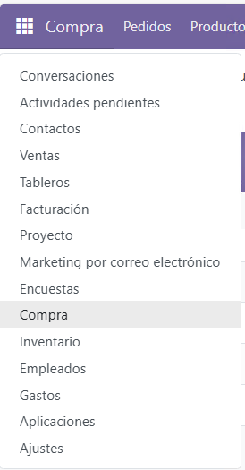
Y le damos a nuevo proveedor.

Creamos los proveedores Nike y Riot Games.
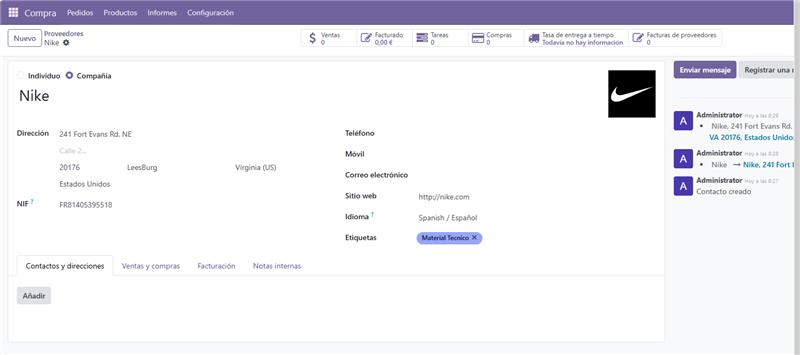
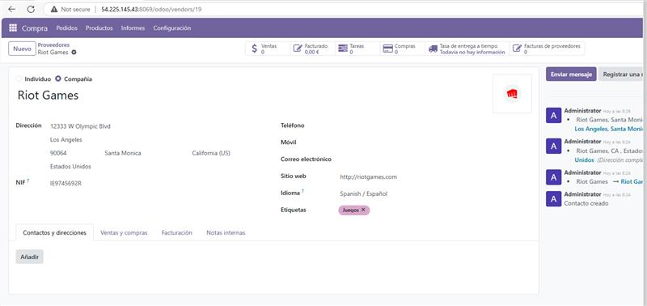
Este sería el resultado de la creación de proveedores.
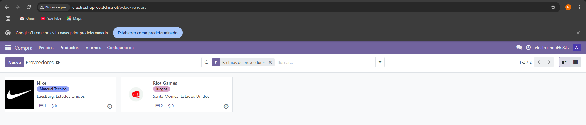
## Resultado final
Este seria el resultado final de toda la creación de usuarios,empleados, clientes y proveedores.
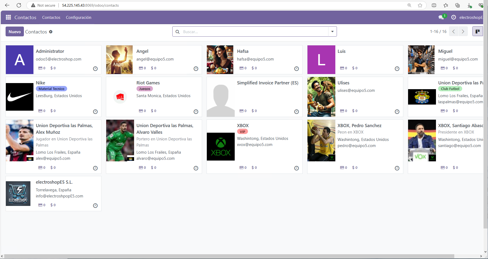 